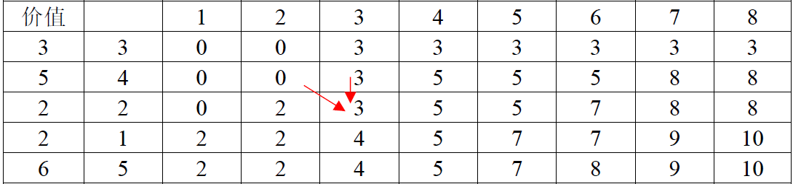
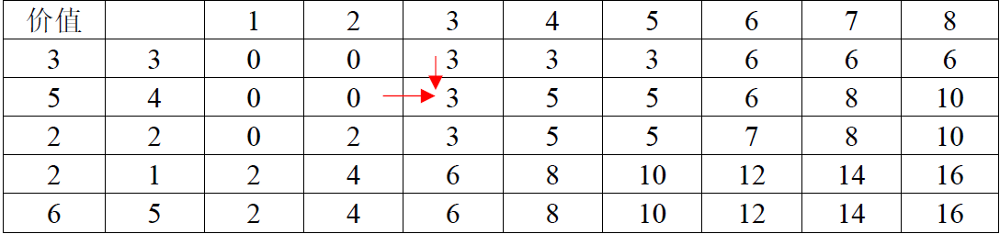
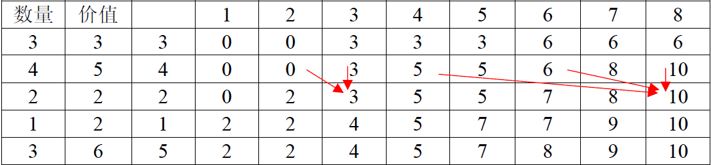
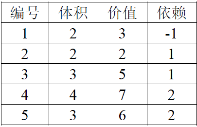
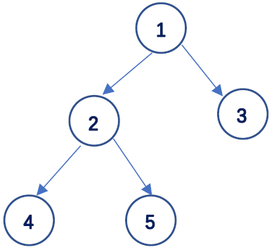
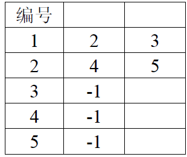

#### <font face="宋体">背包问题
##### 1. 01背包
&emsp;&emsp;01背包是其余背包问题的基础，问题形式十分简单，假设背包容量为$V$，现在有$N$件物品，第$i$个物品的体积为$c[i]$，价值为$w[i]$，要求选择不同的组使得装进背包后的总价值最大。这里需要注意的是，每个物品只有一个，所以称其为01背包问题。
&emsp;&emsp;解决该问题的最朴素的想法是将所有的组合枚举出来，所有的组合个数有$2^n$个，这是指数级的，显然该问题是np问题。但是该问题存在动态规划解。这里以$c[\ ] = {3,4,2,1,5}$,$w[\ ] = {3,5,2,2,6}$为例。我们如果将问题规模放小一点，就是减少需要枚举的物品的数量，或者减少背包容量，则很容易将问题求出。当问题规模增大时，我们可以根据之前已经解决的问题来解决当前问题。具体地，当有新的物品加进来时，我们可以选择是否将该物品放入背包。
$$
dp[i][j] = max(dp[i-1][j],dp[i-1][j-c[i]] + w[i])
$$
以上为01背包问题的动态规划方程，这里的状态有背包容量和物品数量两个，动作只有物品放入背包和不放入背包两个。如果物品不放入背包，那当前的物品数量状态与$i-1$一致，当前的背包容量与$j$一致。如果物品放入背包，当前的物品数量状态与$i-1$一致，但是背包容量将会变为$j-c[i]$。以下为01背包动态规划处理的主流程。
```cpp
 for (int i = 1; i <= n; ++i)
    {
        for (int j = 1; j <= v; ++j)
        {
            if (c[i] <= j)
                dp[i][j] = max(dp[i - 1][j], dp[i - 1][j - c[i]] + w[i]);
            else
                dp[i][j] = dp[i - 1][j];
        }
    }
```
这里可以对以上解法进行优化，将原来的二维$dp[i][j]$优化为一维$dp[j]$。这里主要考虑到我们事实上只需要求出给定背包容量下的解，而不需要知道在不同物品数量下的解。$dp[i][j]$数组的变化如下图所示。

$$
dp[j] = max(dp[j], dp[j-c[i]]+ w[i])
$$
注意，以上公式在迭代的时候与使用$dp[i][j]$相同，仅仅是用$dp[j]$来存储一些中间变量。
```cpp
   for (int i = 1; i <= n; ++i)
    {
        for (int j = v; j >= 0; --j)
        {
            if (j >= c[i])
                dp[j] = max(dp[j], dp[j - c[i]] + w[i]);
        }
    }
```
这里需要注意$j$是逆序进行的，原因为，当前的$dp[j]$的更新需要用到之前的数据，如果正序进行则会改变之前的数据，导致数据出错。
##### 2. 完全背包问题
&emsp;&emsp;相对于01背包问题，完全背包问题中的物品数量是无限的，可以装走该种物品的任意数量。其状态依然有两个，分别是，物品的种类数量和背包的容量。从动态规划的思想来考虑，将规模较大的问题分解成规模较小的问题，并探索大问题是如何依赖小问题的，从而找到递推关系。
$$
dp[i][j] = max(dp[i-1][j], dp[i][j-c[i]] + w[i])
$$
这里动作依然只有两个，是否选择新种类的物品。如果不选择，状态退回到$dp[i-1][j]$，如果选择，状态退回到$dp[i][j-c[i]]$。这里特别需要注意$dp[i][j-c[i]]$与01背包的$dp[i-1][j-c[i]]$不同。其原因就在于物品可以重复选择。
```cpp
for (int i = 1; i <= n; ++i)
    {
        for (int j = 1; j <= v; ++j)
        {
            if (c[i] <= j)
                dp[i][j] = max(dp[i -1][j], dp[i][j - c[i]] + w[i]);
            else
                dp[i][j] = dp[i - 1][j];
        }
    }
```
$dp[i][j]$的变化如下图所示

与01背包一样，可以使用一维数组优化
$$
dp[j] = max(dp[j], dp[j-c[i]] + w[i])
$$
具体代码为：
```cpp
for(int i = 1; i <= n; ++i)
{
    for(int j = 1; j <= v; ++j)
    {
        if(j >= c[i])
            dp[j] = max(dp[j], dp[j - c[i]] + w[i]);
    }
}
```
与优化后的01背包不同，完全背包的$j$并不是倒序的，原因为$dp[i][j]$依赖于$dp[i-1][j]$与$dp[i][j-c[i]]$，正序并不会导致这两个数据被更改。事实上，完全背包问题可以转化为多重背包问题，具体可以表示为
$$
dp[i][j] = max(dp[i-1][j], dp[i-1][j-k*c[i]]+ k*w[i] | 0 <= k <= (j/c[i]))
$$
这里需要注意$ 0 <= k <= (j/c[i])$这个条件，其中的k需要从0开始到$(j/c[i])$遍历，所以时间复杂度明显较高。前面的迭代式$dp[i][j] = max(dp[i-1][j], dp[i][j-c[i]] + w[i])$实际上是对该式的一个时间上的优化。
##### 3.多重背包
&emsp;&emsp;考虑有N种物品，每种物品的个数为$s[i]$，$s[]={3,4,2,1,3}$。体积为$c[i]$，价值为$w[i]$。背包容量为v，如何选择物品使得背包价值最大。将该问题直接转换为01背包问题，则物品种类将扩大为$sum += s[i]$，DP方程与01背包一致，时间复杂度为$O(sum*V)$。若不转化为01背包问题，将该问题直接求解，此时的动作就不是两个而是$s[i]+1$个，$DP$方程为：
$$
dp[i][j] = max(dp[i-1][j], dp[i-1][j-k*c[i]] + w[i] | 1 <= k <=s[i])
$$
直接使用二维数组的代码为
```cpp
for (int i = 1; i <= n; ++i)
{
    for (int j = 1; j <= v; ++j)
    {
        dp[i][j] = dp[i - 1][j];
        for (int k = 1; k <= s[i] && j >= k * c[i]; ++k)
        {
            dp[i][j] = max(dp[i][j], dp[i-1][j - k * c[i]] + k * w[i]);
        }
    }
}
```
$dp[i][j]$的变化如下图所示。

同样可以使用一维数组优化多重背包问题
```cpp
    for (int i = 1; i <= n; ++i)
    {
        for (int j = v; j >= 0; --j)
        {
            for (int k = 0; k <=s[i] && k * c[i] <= j; ++k)
            {
                dp[j] = max(dp[j], dp[j - k * c[i]] + k * w[i]);
            }
        }
    }
```
这里需要注意，与01背包一致，对$j$的遍历需要逆序操作，防止更改之前的数据。但是这样做多重背包的时间复杂度为${\large O} (v*n*\max_i{s[i]})$是${\large O(n^{3})}$级的，相较于01背包的时间复杂度较高，一种朴素的想法是将多重背包看成01背包问题来做。将同种物体看成是体积和价值相同的不同单个物体，再利用01背包的算法，拆分后的时间复杂度为$\large O(v*\sum_{i}^{n}(s[i]))$，事实上这个时间复杂度并没有降低太多。可以考虑将同一种物体进行分组。例如，一件物品的个数是$18$，可以将$18$分解成$1\ 2\ 4\ 8\ 3$，从1到18中的任意整数都可以选取这组数中的一个,进行相加来表示。这意味着如果将18分成这6个数，放入$c[i]$与$w[i]$数组中，进行01背包的时候，就隐式地将从1到18的数全选了一遍。这样做的时间复杂度为$\large O(v*\sum_{i}^{n}(log(s[i])))$。可以有效地降低时间复杂度。二进制优化的多重背包问题，程序示例如下。
```cpp
for (int i = 1; i <= n; ++i)
    {
        int _c;
        int _w;
        int _s;
        cin >> _c >> _w >> _s;
        int a = 1;
        int sum = a;
        c[cnt] = _c;
        w[cnt] = _w;
        ++cnt;
        while (sum + 2 * a < _s)
        {
            a *= 2;
            sum += a;
            c[cnt] = a * _c;
            w[cnt] = a * _w;
            ++cnt;
        }
        c[cnt] = (_s - sum) * _c;
        w[cnt++] = (_s - sum) * _w;
    }
    n = cnt - 1;
    for (int i = 1; i <= n; ++i)
    {
        for (int j = v; j >= 0; --j)
        {
            if (c[i] <= j)
                dp[j] = max(dp[j], dp[j - c[i]] + w[i]);
        }
    }
```
以上程序先对$s[i]$进行二进制的分解，同01背包一样进行动态规划求解。
##### 4.多重背包的单调队列优化
&emsp;&emsp;以上对多重背包做了二进制优化，下面介绍使用单调队列的优化方法。这里考虑$dp[i][j]=max(dp[i-1][j-k*c[i]]+k*w[i]),0\le k\le m[i]$，这里的$m[i]=min(s[i],j/c[i])$。对以上式子做一个简单的变换，$j=k1*c[i]+d，k1=j/c[i]，d=j\%c[i]$，带入上式可得
$$
dp[i][j]=max(dp[i-1][k1*c[i]+d-k*c[i]]+k*w[i])
$$
将$c[i]$合并可得
$$
dp[i][j] = max(dp[i-1][(k1-k)*c[i]+d]+ k*w[i])
$$
再将$k*w[i]$改写为$-(k1-k)*w[i]+k1*w[i]$可得
$$
dp[i][j]=max(dp[i-1][(k1-k)*c[i]+d]-(k1-k)*w[i]+k1*w[i])
$$
这里对$k$循环遍历时(如第3节示例程序所示)，$k1$不依赖于$k$可以将上式的最后一部分从$max()$中拿出来。
$$
dp[i][j]=max(dp[i-1][(k1-k)*c[i]+d]-(k1-k)*w[i])+k1*w[i]
$$
这里用$k=k1-k$对之前的$k$进行代换，可以得到
$$
dp[i][d+k1*c[i]]=max(dp[i-1][k*c[i]+d]-k*w[i])+k1*w[i],(k1-m[i]\le k\le k1)
$$
以上方程说明，将开始需要枚举的$j，k$转化为枚举$j/c[i]，j\%c[i]$
为更好理解以上式子下面以一种物品的个数为$s=4$，体积为$c=3$，价值为$w$，$v=20$为例，对$v$从0到20进行动态规划展开。
$$
\begin{align*}
f(0) &= max(f(0))\newline 
f(1) &= max(f(1))\newline 
f(2) &= max(f(2))\newline 
f(3) &= max(f(3),f(0)+w)\newline 
f(4) &= max(f(4),f(1)+w)\newline 
f(5) &= max(f(5),f(2)+w)\newline 
f(6) &= max(f(6),f(3)+w,f(0)+2w)\newline 
f(7) &= max(f(7),f(4)+w,f(1)+2w)\newline 
f(8) &= max(f(8),f(5)+w,f(2)+2w)\newline 
f(9) &= max(f(9),f(6)+w,f(3)+2w,f(0)+3w)\newline 
f(10) &= max(f(10),f(7)+w,f(4)+2w,f(1)+3w)\newline 
f(11) &= max(f(11),f(8)+w,f(5)+2w,f(2)+3w)\newline
f(12) &= max(f(12),f(9)+w,f(6)+2w,f(3)+3w +f(0)+4w)\newline 
f(13) &= max(f(13),f(10)+w,f(7)+2w,f(4)+3w+f(1)+4w)\newline 
f(14) &= max(f(14),f(11)+w,f(8)+2w,f(5)+3w+f(2)+4w)\newline
f(15) &= max(f(15),f(12)+w,f(9)+2w,f(6)+3w+f(3)+4w)\newline 
f(16) &= max(f(16),f(13)+w,f(10)+2w,f(7)+3w+f(4)+4w)\newline 
f(17) &= max(f(17),f(14)+w,f(11)+2w,f(8)+3w+f(5)+4w)\newline
f(18) &= max(f(18),f(15)+w,f(12)+2w,f(9)+3w+f(6)+4w)\newline
f(19) &= max(f(19),f(16)+w,f(13)+2w,f(10)+3w+f(7)+4w)\newline 
f(20) &= max(f(20),f(17)+w,f(14)+2w,f(11)+3w+f(8)+4w)\newline
\end{align*}
$$
观察上面的dp展开式，发现存在大量的重复比较，将0到20进行分组，第一组：$0,3,6,9,12,15,18$，第二组：$1,4,7,10,13,16,19$，第三组：$2,5,8,11,14,17,20$，每一组都是公差为$s=3$的等差数列，以第一组为例
$$
\begin{align*}
f(0) &= max(f(0))\newline 
f(3) &= max(f(3),f(0)+w)\newline 
f(6) &= max(f(6),f(3)+w,f(0)+2w)\newline
f(9) &= max(f(9),f(6)+w,f(3)+2w,f(0)+3w)\newline 
f(12) &= max(f(12),f(9)+w,f(6)+2w,f(3)+3w +f(0)+4w)\newline 
f(15) &= max(f(15),f(12)+w,f(9)+2w,f(6)+3w+f(3)+4w)\newline 
f(18) &= max(f(18),f(15)+w,f(12)+2w,f(9)+3w+f(6)+4w)\newline
\end{align*}
$$
这里的的$d=0$，将公式改写为
$$
\begin{align*}
f(0) &= max(f(0))\newline 
f(3) &= max(f(3)-w,f(0))+w\newline 
f(6) &= max(f(6)-2w,f(3)-w,f(0))+2w\newline
f(9) &= max(f(9)-3w,f(6)-2w,f(3)-w,f(0))+3w\newline 
f(12) &= max(f(12)-4w,f(9)-3w,f(6)-2w,f(3)-w +f(0))+4w\newline 
f(15) &= max(f(15)-5w,f(12)-4w,f(9)-3w,f(6)-2w+f(3)-w)+5w\newline 
f(18) &= max(f(18)-6w,f(15)-5w,f(12)-4w,f(9)-3w+f(6)-2w)+6w\newline
\end{align*}
$$
变换之后发现事实上，每一组在更新的时候都依赖于之前求出的最大值。
$$
f(i*c[i]+d)-i*w[i]，0\le d\le c[i]，0\le k\le (v-d)/c[i]
$$
需要注意的是在每一组求最大值的时候由于物品个数的限制，所以要求的个数就固定在了$s[i]$，也即是滑动窗口的最大值就是物品的数量，这里显然可以考虑使用单调队列来记录不同窗口下的最大值。示例代码如下。
```cpp
    for (int i = 1; i <= n; i++) // 枚举物品种类
    {
        s[i] = s[i] > (v / c[i]) ? (v / c[i]) : s[i]; // 求lim
        for (int d = 0; d < c[i]; d++)                // 枚举余数
        {
            head = tail = 0; // 队列初始化
            for (int k = 0; k <= (v - d) / c[i]; k++)
            {
                int x = k;
                int y = dp[k * c[i] + d] - k * w[i];
                if(head < tail && que[head].pos < k - s[i])
                    head++; // 限制长度
                while (head < tail && que[tail - 1].value <= y)
                    tail--;
                que[tail].value = y, que[tail].pos = x;
                tail++;
                dp[k * c[i] + d] = que[head].value + k * w[i];
                // 加上k*w[i]的原因:
                // 我们的单调队列维护的是前i-1种的状态最大值.
                // 因此这里加上k*w[i].
            }
        }
    }
```
que是一个结构体数组，里面存放当前组窗口下的最大值。这里的单调队列是递减的，当窗口滑动时，最大值可能被移出队列。
```cpp
if(head < tail && que[head].pos < k - s[i])
    head++; // 限制长度
```
当前的倍数$k$依赖之前的倍数$k1$的范围是$k-k1\le s[i]$，所以将单调队列头部节点移出的条件是$k - q[head].pos > s[i]$。遍历$j$与遍历$d，i$的个数都是$v$，而单调队列的时间复杂度主要取决于尾部增加数据时，是$\large O(s[i])$
##### 5.分组背包问题
&emsp;&emsp;分组背包问题，具体的来说是，存在不同组别的物品，每个组里面有数量不同的物品，要求每个组只能选一个，能使给定的背包体积$V$拥有最大的价值。这个问题可以将原来的动作分解成3个动作，先选定给的组别，在组别里选定物品。该问题的状态转移方程与01背包并无区别。最大的区别在于，当遍历组别，和体积时需要遍历该组别下的所有物品。这时的问题和01背包问题一致。
```cpp
    for (int i = 1; i <= n; ++i)            // 遍历不同的组别
        for (int j = V; j >= 0; --j)        // 遍历所有的体积
            for (int k = 1; k <= g[i]; ++k) // 遍历该组别的所有物品
            {
                if (j >= group[i][k].v)
                    dp[j] = max(dp[j], dp[j - group[i][k].v] + group[i][k].w);
            }
```
这里的$n$是所有的组别，$V$是背包可容纳的体积，而$g[i]$是该组的物品个数。这里需要注意，必须先遍历在给定组别与给定体积下遍历组别里的物品。具体原因为，$dp$数组是一维的，如果先遍历体积$j$将$g[i]$放到外循环可能会导致同一组的物品被重复选择，这与分组背包问题不符。如果使用二维数组$dp[i][j]$通过代码优化则不会存在这样的问题。同理，可以思考01背包和完全背包还有多重背包的内外层循环是否可以互换。事实上，如果仔细思考$dp$的迭代过程会发现内外层循环一般是不可以互换的，可能会导致状态没有更新就直接使用。
##### 6.依赖型背包问题
&emsp;&emsp;依赖型背包问题具体来说，有一个根物品，其他物品又有自己的依赖物品，规定选择该物品时依赖物品必须被选择，求给定依赖关系和物品的体积与价值，体积为$V$的背包能获得的最大价值。物品实际上会组织成以某个物品为根节点的树，而这个问题实际是求以该根节点的物品，在给定$V$时的最大值。如父节点为$x$，它的子节点为$\{y_1,y_2,y_3,y_4...\}$。仔细分析可以得到，在求某个节点$x$的子树的最大价值的时候，子树必须选择父节点$x$，而父节点的解决又依赖于子树$y$最大价值问题的解决。所以可以递归求每个子节点的$dp[x][v]$值，这里的$dp[x][v]$表示以节点$n$为子树在背包体积为$v$的最大值。原始数据如下

下图是数据的示意图。

该图的邻接数组如下。

只有处理节点2，3才能处理根节点，只有处理了节点4，5才能处理节点2。这显然是一个递归问题。在求出子树的$dp[x][v]$的值时，通过以下状态转移方程可求出父节点的$dp[x][v]$
$$
dp[x][v] = max(dp[k][v-c[k]])，k\in S
$$
$S$是节点$x$的子节点集合。示例程序如下。
```cpp
const int N = 4e4;
const int M = 65;
int dp[M][N];
vector<int> G[M];  // 邻接数组存储图
int c[N];
int w[N];
int n;
int V;
void utiltiy(int x) // 将父节点输入
{
    for (int i = c[x]; i <= V; ++i)
        dp[x][i] = w[x];                  // 将所有以x为父节点的子树都加上父节点的价值
    for (int i = 0; i < G[x].size(); ++i) // 遍历x节点的所有子节点
    {
        int y = G[x][i]; // x节点的子节点
        utiltiy(y); // 递归求解子节点y
        for (int j = V; j >= c[x]; --j)
        {
            for (int k = 0; k <= j - c[x]; ++k)
            {
                dp[x][j] = max(dp[x][j], dp[x][j - k] + dp[y][k]);
            }
        }
    }
}
```
如果将递归操作去掉的话，这个问题和分组背包问题一致，最外层循环，实际是将以子节点为根的树看做若干组，每个组里只能选择一个体积为$k$，价值为$dp[y][k]$的物品。这里唯一与分组背包不同的是这里的体积和价值是求出来的，并且不是事实上的物品，是组合出来的物品和价值。当然这里的k是有范围的，不能超过父节点$x$的体积，否则无法选取父节点$x$。