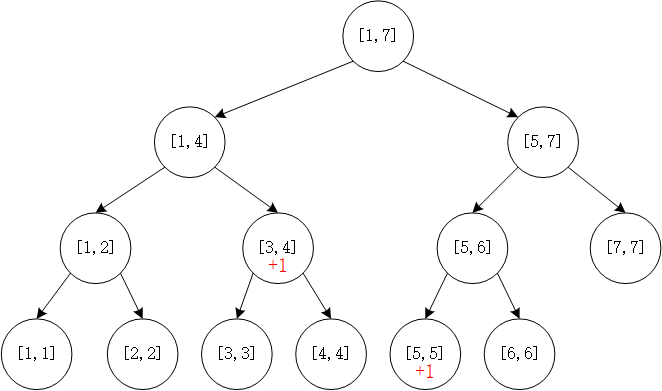
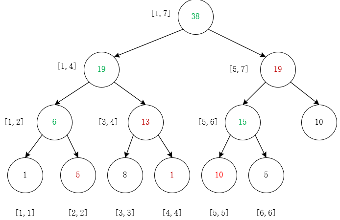

#### <font face="宋体">线段树
&emsp;&emsp;线段树主要用于维护数组的区间信息，要求对区间的操作满足结合律，比如求区间和，求区间的最大值和最小值。与线段树相似的数据结构还有树状数组，线段树可以实现$\large O(log(n))$级别的区间修改和区间查询。并且该数据结构支持如加减、乘的操作。
###### 1.满足的问题: 区间求和、区间求最大值等
###### 2.不满足的问题: 区间求众数、区间最长连续、区间最长不下降问题，事实上这些问题不能通过两个区间的合并来得出结果，这意味着不满足结合律。
&emsp;&emsp;以一个7元素的数组为例，下图是该数组的线段树

可以看到根节点维护的是数组所有元素的信息，而左子节点维护的是$[left,mid]$，其中$mid=(left+right)/2$，右子节点维护的是$[mid+1,right]$，以此递归向下直到$left=right$该节点没有子节点。接下来，以维护区间和为例，来演示线段树的建立，区间查询、区间修改。相较于原数组$arr$，我们新建数组为$larr$用来存储线段树。这里$larr$的存储能力应该至少为$arr$个数的4倍。类segmentTree的成员函数和成员变量如下
```cpp
template <class T>
class segmentTree
{
private:
    T *larr; // 维护原始数组区间信息的线段树
    T *arr; // 原始数组
    T *lazyMark; // lazy标记
    int treeSize; // 线段树的大小

public:
    segmentTree(int cap = 10000);
    ~segmentTree();
    void build(T *arr, int n);
    void build(int l, int r, int p);                                    // 可以递归建立线段树
    void alter(int l, int r, int theNode, int theNum, int p = 1);       // 递归查询，并更改
    void putDown(int p, int rn, int ln);                                // 将当前区间的lazy标记消去，并将该标记传递至p的子节点
    void intervalAlter(int l, int r, int tl, int tr, int C, int p = 1); // C为要更改的数
    int intervalQuery(int l, int r, int ql, int qr, int p = 1);
};
```
##### 1.线段树的建立
&emsp;&emsp;线段树的建立过程，由于父节点$p$的信息依赖于子节点$2p$与$2p+1$，而子节点又依赖于它的左右子节点，直到没有子节点为止，所以，线段树的建立过程可以使用一个递归函数来建立。假定$arr[7]=\{1,3,7,2,9,5,10\}$示例代码如下。
```cpp
template <class T>
void segmentTree<T>::build(int l, int r, int p)
{
    if (l == r)
    {
        this->larr[p] = arr[l];
        return;
    }
    int mid = (l + r) >> 1;
    build(l, mid, 2 * p);
    build(mid + 1, r, 2 * p + 1);
    this->larr[p] = this->larr[2*p] + this->larr[2*p+1];
}
```
##### 2.线段树的单点更改
&emsp;&emsp;单点更改时需要查找线段树当前在哪个区间，将该区间值修改并且向下查询，直到到达叶子结点。这个过程仍然是递归过程。
```cpp
template <class T>
void segmentTree<T>::alter(int l, int r, int theNode, int theNum, int p)
{
    if (l == r) // 到达叶子结点
    {
        this->larr[p] = theNum;
        this->arr[l] = theNum;
        return;
    }
    int mid = (l + r) >> 1;
    if (theNode >= l && theNode <= mid) // 如果该节点在p的左区间
        alter(l, mid, theNode, theNum, 2 * p);
    if (theNode <= r && theNode >= mid + 1) // 如果改节点在p的右区间
        alter(mid + 1, r, theNode, theNum, 2 * p + 1);
    this->larr[p] = this->larr[2 * p] + this->larr[2 * p + 1];
}
```
##### 3.线段树的区间更改
&emsp;&emsp;事实上区间更改可以分解成若干个单点修改，但是如果这样做时间复杂度为$\large O(mlog(n))$，其中$m$是修改区间的元素个数。这里引入一个懒惰标记，存储在$lazyMark$中，这个数组的大小应该与线段树数组的大小一致。具体过程为，如果要修改的区间完全覆盖当前区间，直接将当前区间的值修改掉，不再向下继续查找，并且在当前区间的$lazyMark$的$p$节点上标记一个懒惰标记。所以称之为"懒惰"，原因就是不再向下修改了。如果要修改的区间，没有覆盖当前区间，判断该区间是否与当前区间的左区间或者右区间有交集，如果有递归向下。例如，我们想将$[3,5]$之间的元素+1，根据以上流程被标记为懒惰标记的为节点5和节点12。图示如下。

这个过程为，要更改的区间为$[3,5]$，当前区间为$[1,7]$，显然没有覆盖当前区间。当前区间的左区间为$[1,4]$，与要更改区间有交集。需要将左区间作为当前区间。与当前区间的右区间$[5,7]$有交集。第一次操作后的线段树如下。

lazyMark如下

继续对线段树操作，将区间$[4,7]$减去2。操作后的线段树如下。

操作后的lazyMark如下

线段树的区间修改示例代码如下
```cpp
template <class T>
void segmentTree<T>::intervalAlter(int l, int r, int tl, int tr, int C, int p)
{
    if (l >= tl && r <= tr) // 当前区间被完全覆盖
    {
        this->larr[p] += C * (r - l + 1);
        this->lazyMark[p] += C;
        return;
    }
    int mid = (l + r) >> 1;
    putDown(p, r - mid, mid - l + 1); // 将当前节点的lazy标记向子节点下移
    if (mid >= tl && l <= tr)          // 与左子区间有交集
        intervalAlter(l, mid, tl, tr, C, 2 * p);
    if (r >= tl && tr <= mid + 1) // 与右子区间有交集
        intervalAlter(mid + 1, r, tl, tr, C, 2 * p + 1);
    this->larr[p] = this->larr[2 * p] + this->larr[2 * p + 1];
}
```
下一个操作将$[2,4]$的元素+2可以得到线段树的变化如下

+2后的lazyMark如下

##### 3.线段树的区间查询。
&emsp;&emsp;相对于区间更改，区间查询更简单。如果要查询的区间完全覆盖当前区间，直接将该节点的值返回，若该区间与当前区间有交集，必须将当前区间的lazyMark标记下推，否则继续向下查询将会出错。示例程序如下。
```cpp
template <class T>
T segmentTree<T>::intervalQuery(int l, int r, int ql, int qr, int p)
{
    if (l >= ql && r <= qr)
        return this->larr[p];
    int mid = (l + r) >> 1;
    putDown(p, r - mid, mid - l + 1);
    T result1 = T();
    T result2 = T();
    if (ql <= mid && qr >= l)
        result1 = intervalQuery(l, mid, ql, qr, 2 * p);
    if (r >= ql && (mid + 1) <= qr)
        result2 = intervalQuery(mid + 1, r, ql, qr, 2 * p + 1);
    return result1 + result2;
}
```
查询后的线段树如下图所示。

查询后的lazyMark如下图所示。

